<div align="center">

# Smart Agri-Drone for Sustainable Farming

**An autonomous quadcopter that finds diseased mango leaves with YOLOv8 and sprays only the trees that need it.**

Capstone project, Department of Mechatronics Engineering (MTE),
Rajshahi University of Engineering & Technology (RUET)

[](.github/workflows/ci.yml)


[](LICENSE)

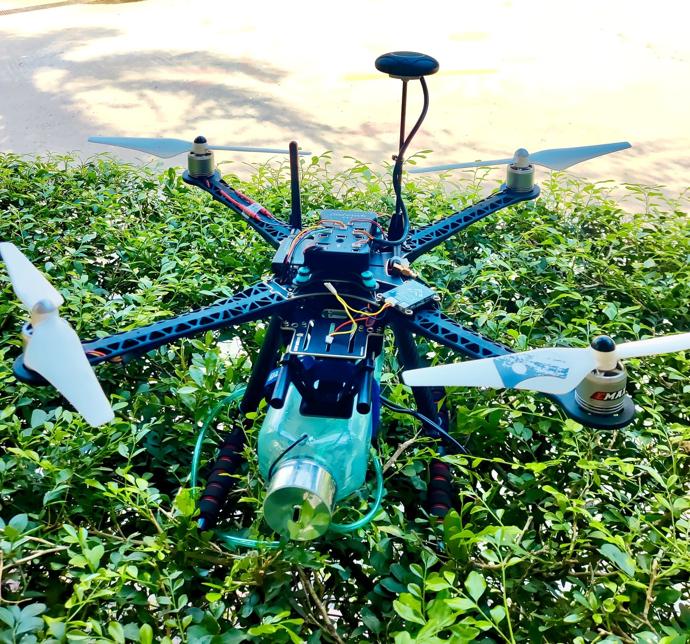

</div>

---

## Contents

- [Why](#why) · [What it does](#what-it-does) · [Results](#results) · [Demo videos](#demo-videos)
- [Hardware](#hardware) · [Dataset](#dataset) · [Software](#software) · [Quick start](#quick-start)
- [Repository layout](#repository-layout) · [Cost](#cost) · [Limitations](#limitations) · [Team](#team) · [References](#references)

## Why

Agriculture is the backbone of Bangladesh, and the country grows some of the best mangoes in the world, many of them for export. Mango production is vulnerable to leaf diseases. Most farmers still inspect trees by eye and spray whole orchards by hand, so early signs are missed and far more pesticide is used than needed.

This project replaces blanket spraying with **detect-then-treat**: a drone flies a GPS route over the orchard, a camera-and-AI system on board spots diseased leaves, and a small pump sprays only those trees.

**Goals**

- Promote sustainable farming
- Build an autonomous, intelligent system
- Improve leaf-disease management using machine learning
- Increase productivity and reduce chemical use

## What it does

```
 Pixhawk (AUTO mission)              Raspberry Pi 5 (this repo)
 ─────────────────────               ─────────────────────────────────────────────
 auto take-off                       Pi camera ─► YOLOv8 ─► spray decision ─► relay ─► 12 V pump
 fly GPS waypoints  ── MAVLink ───►  GPS position ─────────┘        │
 return / land                                                      └─► geo-tagged log + map
```

1. **Plan:** `agri-mission` generates a serpentine survey over the orchard and uploads it to the Pixhawk.
2. **Fly:** the Pixhawk takes off, follows the waypoints and returns home on its own. The pilot keeps the RC transmitter as a safety override.
3. **Detect:** the Pi 5 runs a custom-trained YOLOv8 model on the live camera feed and recognises six mango-leaf diseases.
4. **Treat:** once a disease is confirmed over several frames, the Pi switches the pump relay for a short burst. A cooldown and a minimum distance stop it re-spraying the same tree.
5. **Map:** every confirmed infection is logged with its GPS position (CSV + GeoJSON), and `tools/plot_infection_map.py` draws them on a satellite map.

## Results

| Metric | Value |
|---|---|
| Precision (test set) | **96.4 %** |
| Recall (test set) | **95.3 %** |
| mAP@50 (test set) | **98.6 %** |
| Detection accuracy in real-field tests | **91.8 %** |
| GPS position error | **0.73 m** |
| Spraying efficiency | **93 %** |

Field accuracy was lower than test-set accuracy, mainly because of sunlight, wind and tree-cover effects in the orchard. See [docs/results.md](docs/results.md).

## Demo videos

| Flight test 1: take-off | Flight test 2: autonomous flight | Flight test 3: dusk hover | Real-time leaf detection |
|:---:|:---:|:---:|:---:|
| [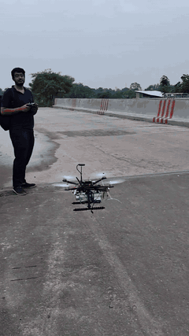](assets/videos/flight-test-01-takeoff.mp4) | [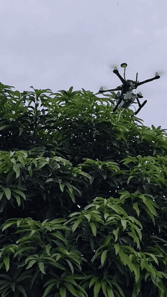](assets/videos/flight-test-02-autonomous-flight.mp4) | [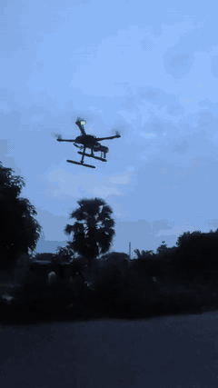](assets/videos/flight-test-03-dusk-hover.mp4) | [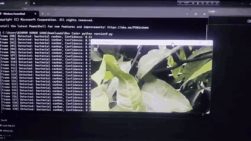](assets/videos/realtime-leaf-disease-detection.mp4) |

Click a preview to open the full video.

<p align="center">
  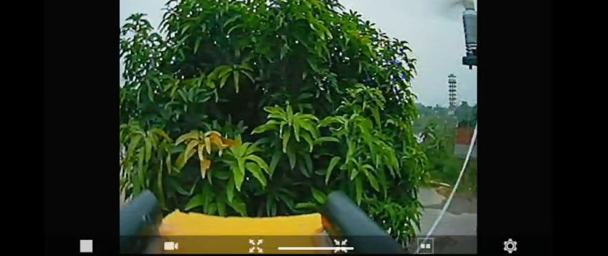
  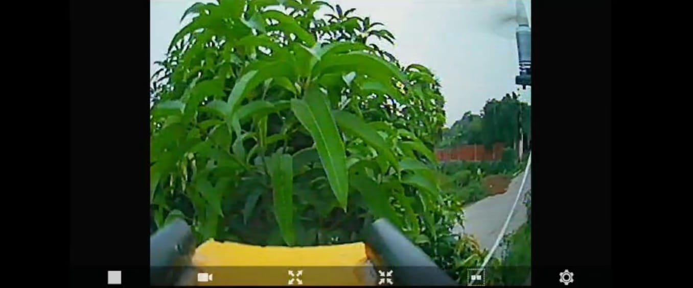
  <br><em>FPV view from the drone during operation</em>
</p>

## Hardware

<p align="center">
  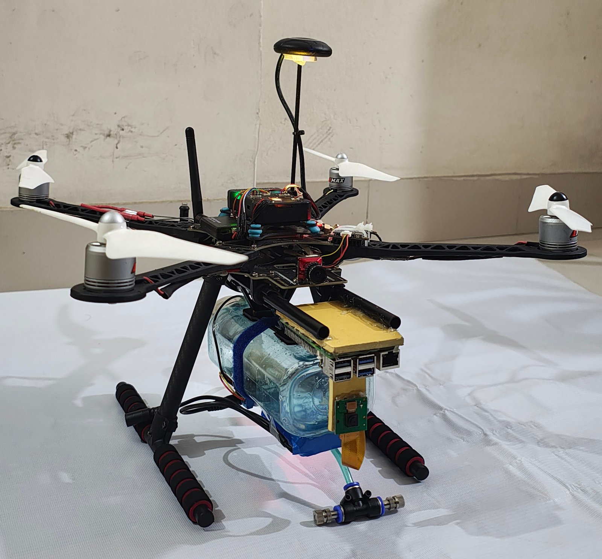
  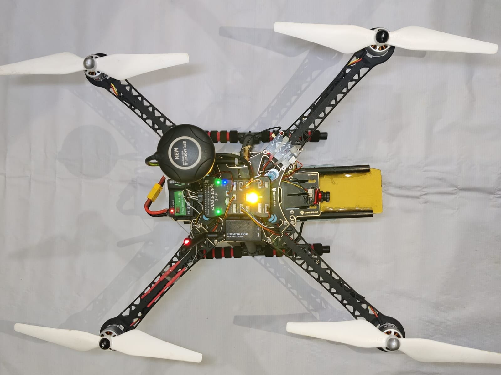
  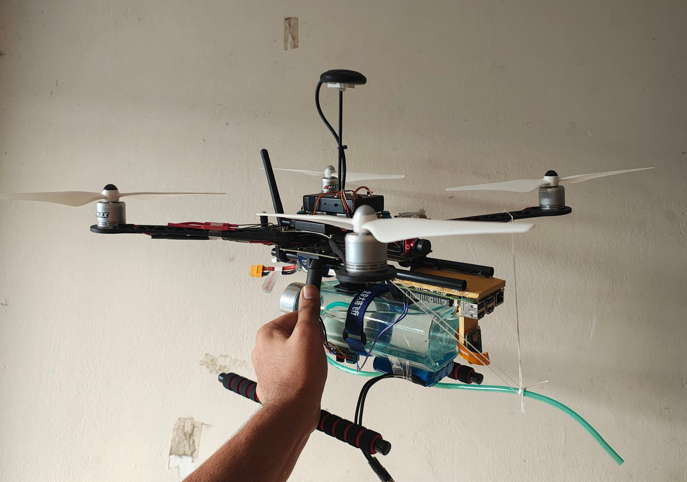
</p>

| Subsystem | Parts |
|---|---|
| Airframe | S500 quadcopter frame, 4 × DJI 800 KV motors, 4 × 20 A BLHeli-S ESCs, propellers |
| Flight control | Pixhawk 2.4.8, M8N GPS, power module, 915 MHz telemetry |
| Companion computer | Raspberry Pi 5 (8 GB) + active cooler, Pi camera |
| Spraying | Reservoir bottle, 12 V pump, 2-channel relay, pipe, nozzle |
| Video / control | Caddx Ratel 2 FPV camera + VTX, SKYDROID 5.8 GHz receiver, FlySky FS-i6 + FS-iA10B |
| Power | 4S LiPo, balance charger, 27 W USB-C supply for the Pi |

<p align="center">
  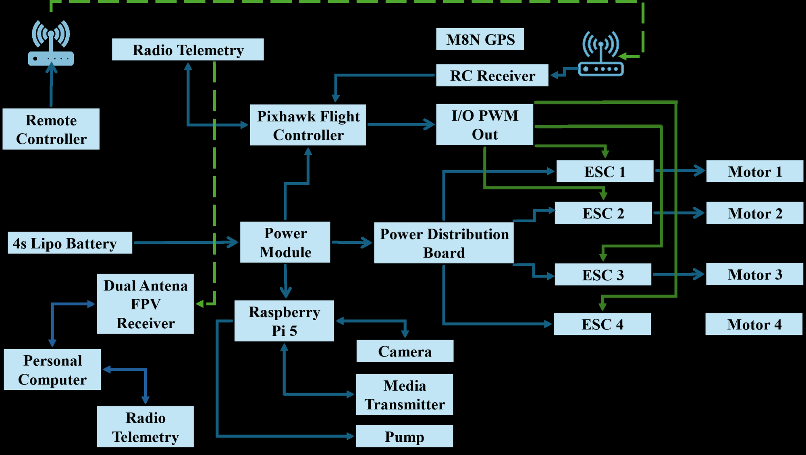
  <br><em>System connection diagram</em>
</p>

Full component list, wiring and setup: [docs/hardware.md](docs/hardware.md).

## Dataset

We collected a **primary dataset of 7,443 mango-leaf images** from orchards and used data augmentation to make the model robust to field conditions. It covers six classes:

<p align="center">
  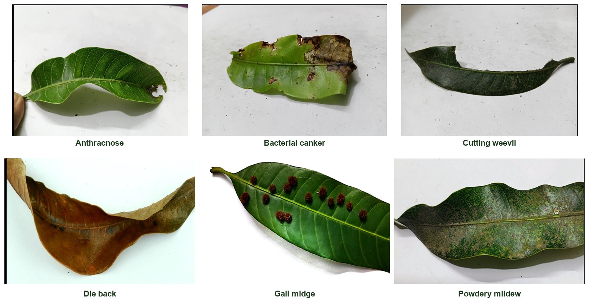
</p>

| Class | Cause | Symptom |
|---|---|---|
| Anthracnose | Fungus | Dark spots and twisting |
| Bacterial canker | Bacteria | Water-soaked lesions, leaf spots |
| Cutting weevil | Insect | Leaves cut off by weevils |
| Die back | Fungus | Leaf tips and branches dry out |
| Gall midge | Insect | Bumps and swellings on leaves |
| Powdery mildew | Fungus | White powdery coating |

Details: [docs/dataset.md](docs/dataset.md).

## Software

| Part | Where | What |
|---|---|---|
| Onboard runtime | [`src/smart_agri_drone/`](src/smart_agri_drone) | Camera → YOLOv8 → spray decision → relay, GPS geotagging (`agri-drone`) |
| Mission planner | [`src/smart_agri_drone/mission.py`](src/smart_agri_drone/mission.py) | Survey grid / CSV waypoints → MAVLink upload → arm and start (`agri-mission`) |
| Model training | [`ml/scripts/`](ml/scripts) | Split, augment, train, evaluate, export (NCNN for the Pi), predict |
| Tools | [`tools/`](tools) | Infection map from a flight log |
| Config | [`configs/`](configs) | `drone.yaml` for flight, `bench.yaml` for laptop testing |
| Tests | [`tests/`](tests) | Spray logic, missions, config and logging; no hardware needed |

## Quick start

### 1. Train the model (workstation, GPU recommended)

```bash
pip install -r requirements-train.txt
python ml/scripts/split_dataset.py --src path/to/raw_dataset   # -> data/mango_leaf/{train,val,test}
python ml/scripts/augment.py --copies 2
python ml/scripts/train.py --model yolov8n.pt --epochs 100     # -> models/best.pt
python ml/scripts/evaluate.py                                  # precision / recall / mAP on the test set
python ml/scripts/export.py --format ncnn                      # -> models/best_ncnn_model for the Pi
```

### 2. Try it on a laptop with a webcam

```bash
pip install -e ".[onboard]"
agri-drone --config configs/bench.yaml --dry-run --show
```

### 3. Fly it

```bash
# On the Raspberry Pi 5 (see docs/deployment.md for the OS, UART and Pixhawk setup)
sudo apt install -y python3-picamera2
pip install -e ".[onboard]"

# Plan and upload a survey of the orchard (opposite corners, 5 m altitude, 6 m between passes)
agri-mission --survey 24.36400 88.62800 24.36436 88.62830 --alt 5 --spacing 6 --connect /dev/ttyAMA0

# Start detection + spraying, then switch the Pixhawk to AUTO from the RC transmitter
agri-drone --config configs/drone.yaml

# After landing: plot the infected trees
pip install folium
python tools/plot_infection_map.py runs/flights/<timestamp>/infections.csv
```

> ⚠️ Always fly with a pilot holding the RC transmitter, props off during bench tests, and within local aviation rules. Test with `--dry-run` before filling the tank.

## Repository layout

```
.
├── assets/
│   ├── images/
│   │   ├── hardware/     prototype photos, components, block diagram
│   │   ├── field/        mango orchard and leaf collection
│   │   ├── dataset/      sample image per disease class
│   │   └── results/      FPV views, flight-test stills, detection demo
│   └── videos/           flight tests and real-time detection (+ GIF previews)
├── configs/              drone.yaml (flight), bench.yaml (laptop)
├── data/                 dataset goes here (not tracked)
├── docs/                 hardware, dataset, training, deployment, results, cost
├── missions/             example waypoint file
├── ml/
│   ├── configs/          Ultralytics dataset YAML
│   └── scripts/          split, augment, train, evaluate, export, predict
├── models/               trained weights go here (not tracked)
├── src/smart_agri_drone/ onboard package + mission planner
├── tests/                pytest suite
└── tools/                infection map
```

## Cost

| | Cost (Tk) |
|---|---|
| This prototype | **86,565** |
| Comparable industrial agri-drone (3 kg payload) | ~450,000 |

Item-by-item breakdown: [docs/cost-analysis.md](docs/cost-analysis.md).

## Environmental benefits and SDGs

Spraying only infected trees **reduces pesticide use and farmers' exposure to chemicals**, **lowers emissions**, **protects soil health** and **supports climate-resilient farming**.

| SDG | Contribution |
|---|---|
| 2 – Zero Hunger | Higher yields, fewer losses to disease |
| 9 – Industry, Innovation & Infrastructure | Affordable smart-farming technology |
| 12 – Responsible Consumption & Production | Less chemical use, efficient use of resources |
| 13 – Climate Action | Fewer emissions from excess pesticide, more climate-resilient farms |

## What's new in this project

- Detects disease in real time with AI (YOLOv8) and sprays by GPS on its own. Most farm drones only follow a path or need manual control.
- Combines a Raspberry Pi 5, a Pixhawk flight controller and GPS on a low-cost frame.
- Geo-tags infected zones, so farmers get a disease map as well as treatment.
- The model is easy to retrain, so other crops and diseases can be added.

## Limitations

- Battery capacity limits flight time, so large fields cannot be covered in one flight.
- GPS is less accurate under tree cover, which affects navigation and spray precision.
- Wind, weather and uneven ground affect real-world performance.
- A small dataset may limit detection of rare or new diseases.
- The equipment has a high up-front cost for smallholder farmers.

## Team

| Name | Student ID |
|---|---|
| **Md Abul Basar Roky** | 1908051 |
| **Musfiqur Rahman** | 1908052 |

Department of Mechatronics Engineering, Rajshahi University of Engineering & Technology (RUET), Bangladesh.

If you use this work, please cite it using [CITATION.cff](CITATION.cff).

## References

1. M. Dubbini, S. Candiago, F. Remondino, M. De Giglio, and M. Gattelli, "Evaluating multispectral images and vegetation indices for precision farming applications from UAV images," 2015.
2. H. Rl, V. A. K, U. Karni, S. Karthikeyan, and S. R. Srinivasan, "Application of UAV for pest, weeds and disease detection using Open Computer Vision," in *Proc. ICSSIT*, 2018.
3. J. Zhao, "Drone technology for precision agriculture: Advancements and optimization strategies," *Highlights in Science, Engineering and Technology*, vol. 111, pp. 185–191, 2024.
4. A. Verma, Diksha, and S. Sharma, "Artificial intelligence integrated rice crop disease detection using drones for smart farming," in *Proc. ICCPCT*, 2024, pp. 709–713.
5. A. Abbas et al., "Drones in plant disease assessment, efficient monitoring, and detection: A way forward to smart agriculture," *Agronomy*, vol. 13, no. 6, p. 1524, 2023.
6. G. Borikar, C. Gharat, and S. Deshmukh, "Application of drone systems for spraying pesticides in advanced agriculture: A review," *IOP Conf. Ser.: Mater. Sci. Eng.*, vol. 1259, p. 012015, 2022.
7. R. Murugesan et al., "Early disease detection of leaves using deep learning and drones – Cyber physical systems approach," 2023.

## License

Code is released under the [MIT License](LICENSE). Photos and videos in `assets/` are © the authors. Please credit them if you reuse them.
