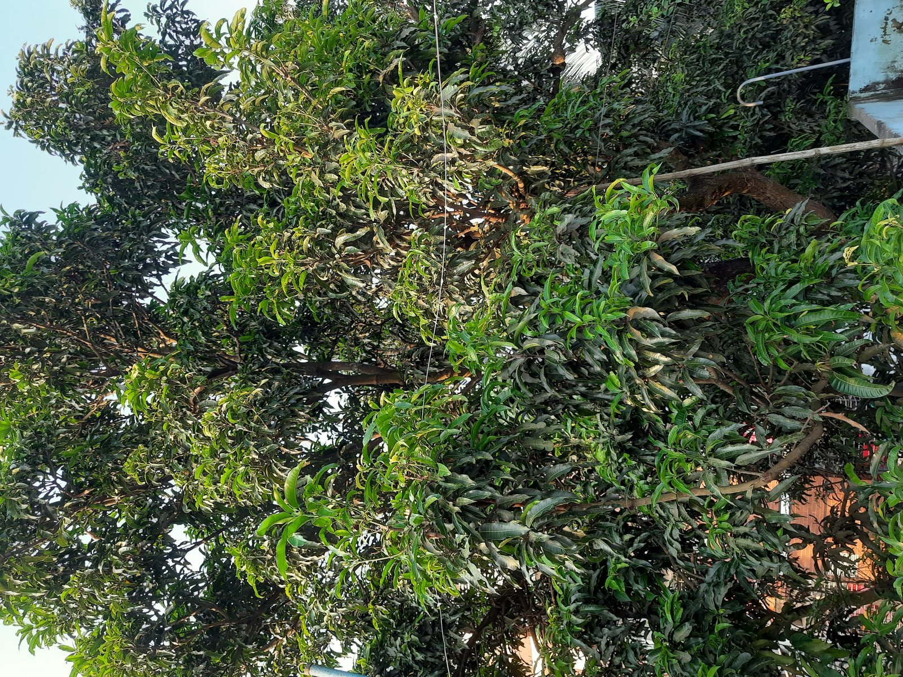
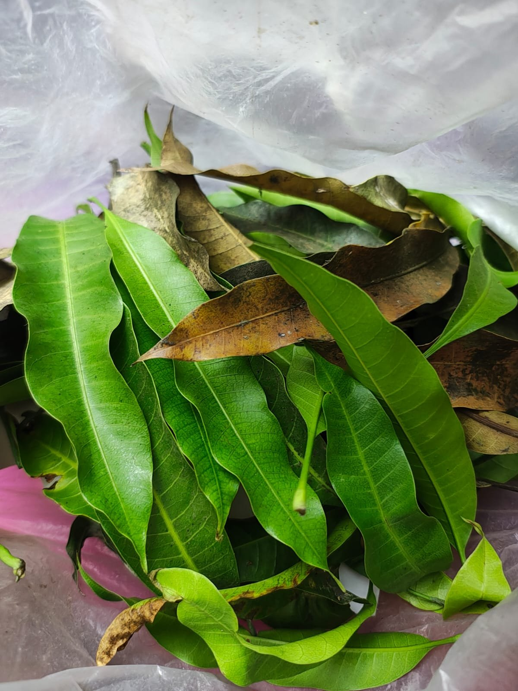
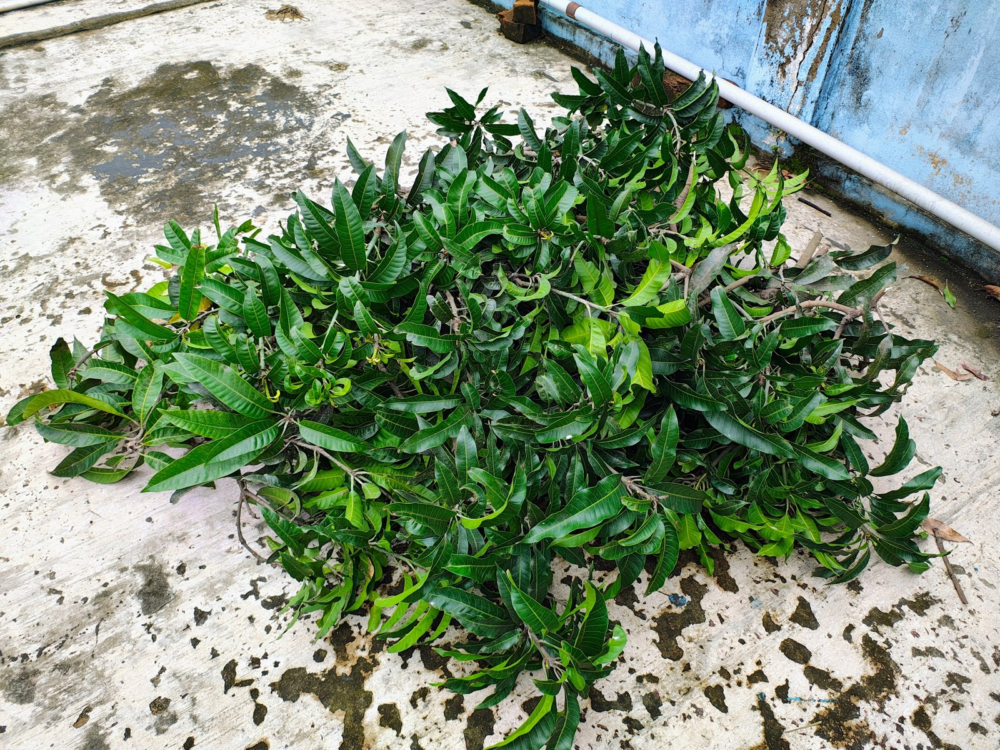
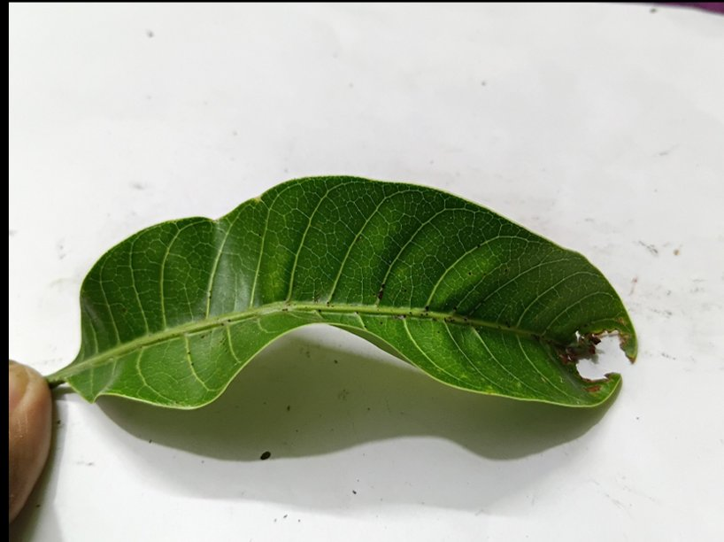
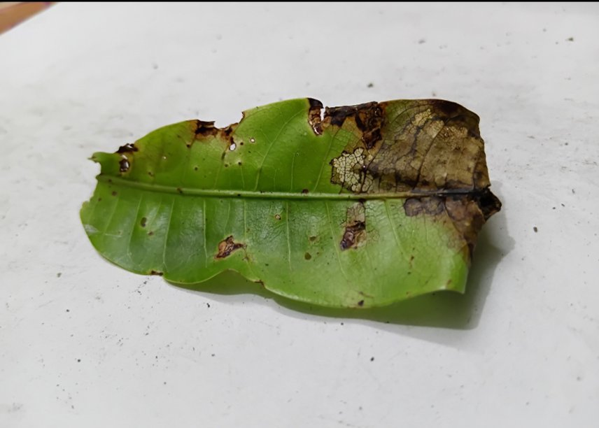
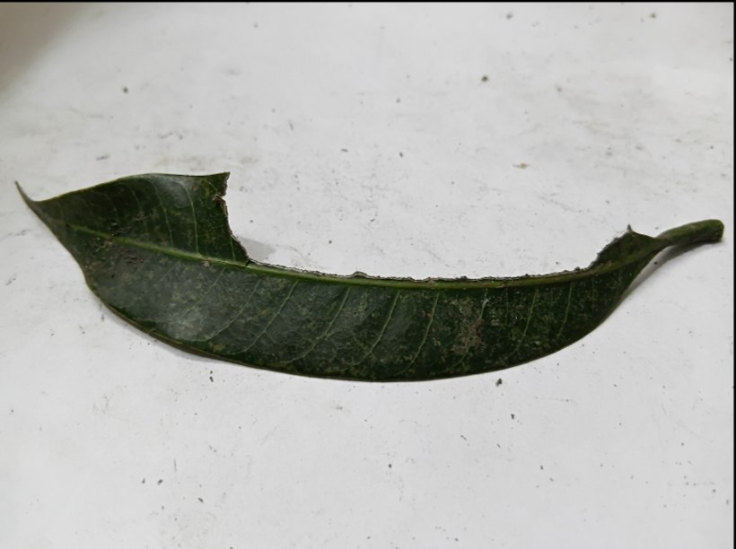
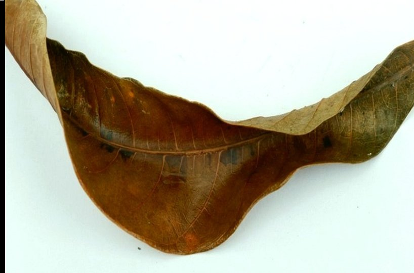
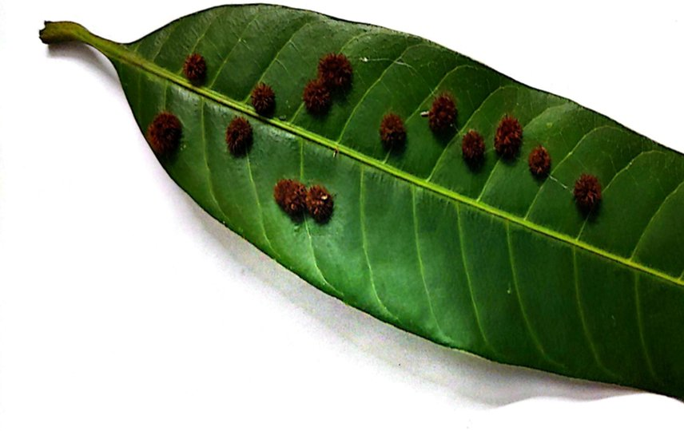
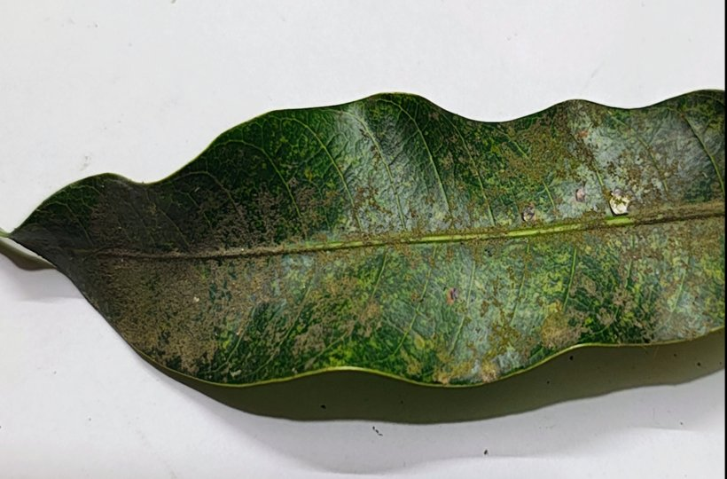

# Mango-leaf disease dataset

## Collection

We collected a primary dataset of **7,443 images** of mango leaves from local mango trees, both healthy-looking and infected. Leaves were photographed on the tree and after picking, against a plain background.

| Mango canopy | Collected leaves | Leaf samples |
|---|---|---|
|  |  |  |

## Classes

| ID | Class | Type | Symptom | Example |
|---|---|---|---|---|
| 0 | `anthracnose` | Fungal | Dark spots and twisting |  |
| 1 | `bacterial_canker` | Bacterial | Water-soaked lesions, leaf spots |  |
| 2 | `cutting_weevil` | Insect | Physical cutting damage |  |
| 3 | `die_back` | Fungal | Drying of leaf tips and branches |  |
| 4 | `gall_midge` | Insect | Bumps or swellings on the leaf |  |
| 5 | `powdery_mildew` | Fungal | White powdery coating |  |

The class order must match [`ml/configs/mango_leaf.yaml`](../ml/configs/mango_leaf.yaml).

## Annotation and layout

Each image is labelled with bounding boxes in YOLO format (`class cx cy w h`, normalised 0–1), one `.txt` per image. Use any YOLO-compatible annotation tool (Roboflow, CVAT, LabelImg), then:

```bash
python ml/scripts/split_dataset.py --src path/to/export --ratios 0.7 0.2 0.1
```

This builds `data/mango_leaf/{train,val,test}/{images,labels}`.

## Augmentation

`ml/scripts/augment.py` adds augmented copies of the **training split only**, so validation and test results stay honest. The transforms mimic what the drone sees: flips, small rotations and zoom, brightness and contrast changes, hue and saturation changes, shadows, motion blur and sensor noise. Bounding boxes are transformed along with the images.

## Availability

The images are not stored in this repository. Contact the authors for access.
