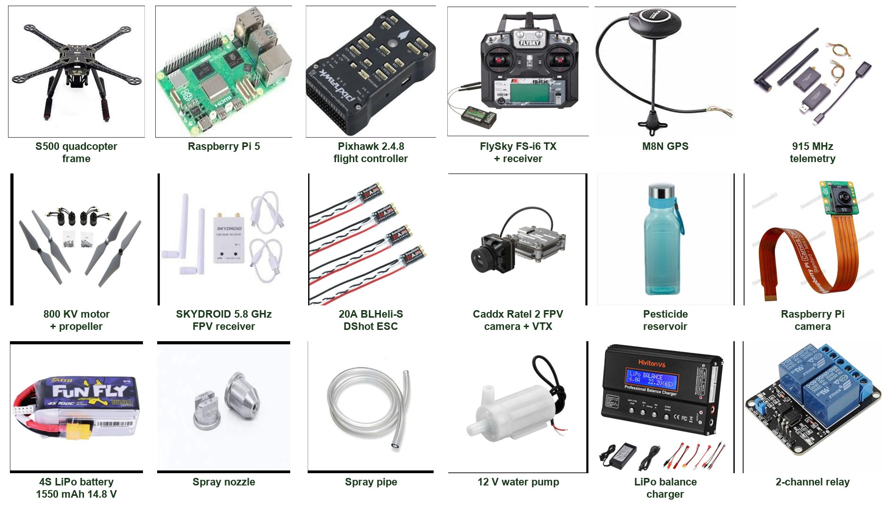

# Hardware

## Components

| # | Component | Role |
|---|---|---|
| 1 | S500 quadcopter frame with carbon-fibre landing gear | Airframe |
| 2 | Raspberry Pi 5 (8 GB) + active cooler | Companion computer: camera, YOLOv8 inference, pump control |
| 3 | Pixhawk 2.4.8 + power module + shock absorber | Flight controller: stabilisation, GPS missions, failsafes |
| 4 | FlySky FS-i6 transmitter + FS-iA10B receiver | Manual control and safety override |
| 5 | M8N GPS | Position for navigation and geotagging |
| 6 | 915 MHz radio telemetry pair | Ground-station link (Mission Planner / QGroundControl) |
| 7 | 4 × DJI 800 KV motors (2 CW + 2 CCW) + propellers | Propulsion |
| 8 | SKYDROID 5.8 GHz dual-antenna receiver | FPV video on the ground |
| 9 | 4 × 20 A BLHeli-S DShot ESCs | Motor speed control |
| 10 | Caddx Ratel 2 FPV camera + VTX | Live pilot view |
| 11 | Reservoir bottle | Pesticide / bio-pesticide tank |
| 12 | Raspberry Pi camera | Detection camera |
| 13 | 4S LiPo battery | Main power |
| 14 | Spray nozzle + pipe | Spray outlet |
| 15 | 12 V water pump | Spray pump |
| 16 | LiPo balance charger | Battery charging |
| 17 | 2-channel relay module | Lets the Pi switch the pump |

## System connections

- **Power:** the 4S LiPo feeds the power module, which supplies the Pixhawk, the power distribution board (ESCs 1–4) and the Raspberry Pi 5.
- **Flight:** the Pixhawk I/O PWM outputs drive ESC 1–4, and each ESC drives one motor. The RC receiver and M8N GPS connect to the Pixhawk.
- **Telemetry:** one 915 MHz radio is on the Pixhawk and the other on the ground computer.
- **Companion link:** Pixhawk **TELEM2** connects to the Pi 5 UART (GPIO14 TX / GPIO15 RX, plus GND). It speaks MAVLink at 57600 baud.
- **Spraying:** Pi GPIO17 drives the relay, which switches the 12 V pump. The pump draws water from the reservoir to the nozzle.
- **Video:** the FPV camera and VTX send video to the 5.8 GHz receiver, which feeds a laptop or screen on the ground.

### Pi 5 pin map

| Pi 5 pin | Connects to |
|---|---|
| GPIO14 (pin 8, TX) | Pixhawk TELEM2 RX |
| GPIO15 (pin 10, RX) | Pixhawk TELEM2 TX |
| GND (pin 6) | Pixhawk TELEM2 GND |
| GPIO17 (pin 11) | Relay IN1 |
| 5 V (pin 2) / GND (pin 9) | Relay VCC / GND |
| CSI camera port | Raspberry Pi camera |

> Do **not** connect the Pixhawk TELEM2 5 V line to the Pi. Power the Pi from its own 5 V / 5 A supply or BEC.

## Prototype

| Side | Top | Spray system |
|---|---|---|
|  |  |  |
