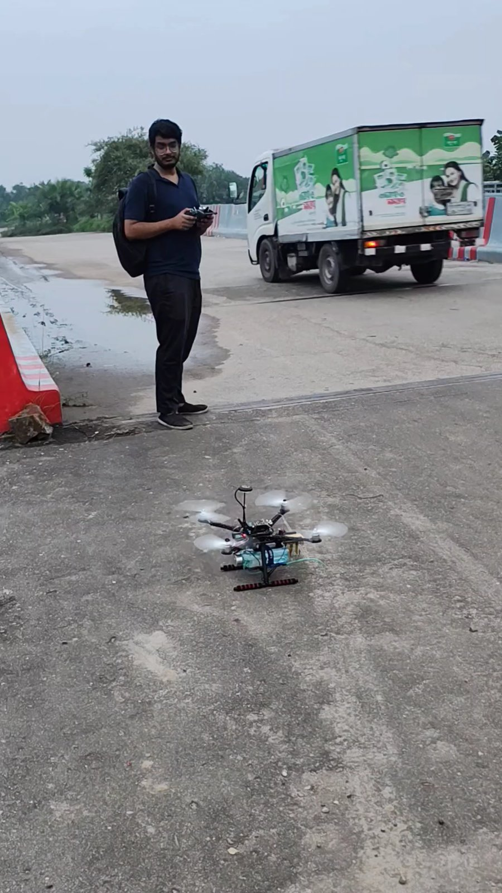
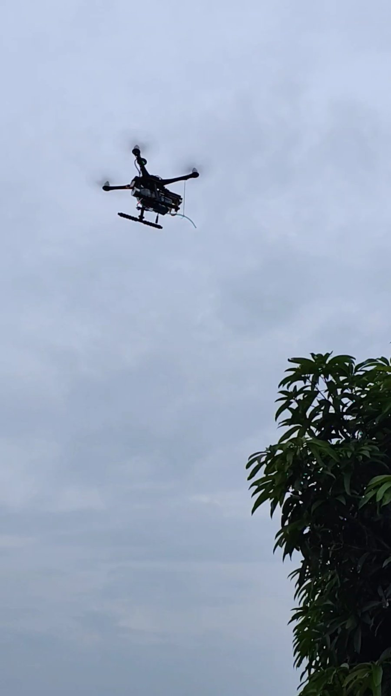
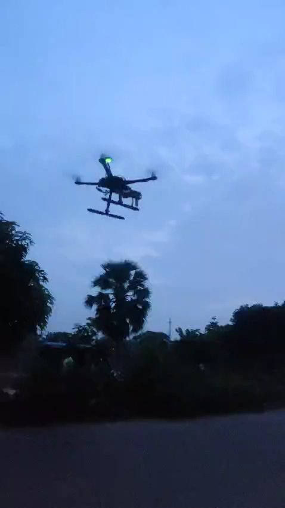

# Results

## Model (held-out test set)

| Precision | Recall | mAP@50 |
|---|---|---|
| **96.4 %** | **95.3 %** | **98.6 %** |

## Field tests

| Metric | Value |
|---|---|
| Detection accuracy | **91.8 %** |
| GPS position error | **0.73 m** |
| Spraying efficiency | **93 %** |

Field accuracy was lower than the test-set result, mainly because of environmental factors: changing sunlight, leaves moving in the wind and prop-wash, motion blur, and weaker GPS under the canopy.

## Flight tests

| Test | Video | Still |
|---|---|---|
| 1 – Take-off with GPS and telemetry | [flight-test-01-takeoff.mp4](../assets/videos/flight-test-01-takeoff.mp4) |  |
| 2 – Autonomous flight on a predefined path | [flight-test-02-autonomous-flight.mp4](../assets/videos/flight-test-02-autonomous-flight.mp4) |  |
| 3 – Hover at dusk | [flight-test-03-dusk-hover.mp4](../assets/videos/flight-test-03-dusk-hover.mp4) |  |
| Real-time leaf-disease detection | [realtime-leaf-disease-detection.mp4](../assets/videos/realtime-leaf-disease-detection.mp4) |  |

## FPV view during operation

## Summary

- Built a smart drone that uses machine learning for crop-disease detection and targeted spraying.
- Collected a primary dataset of 7,443 mango-leaf images and used data augmentation for better training.
- The YOLOv8 model reached 96.4 % precision, 95.3 % recall and 98.6 % mAP@50 on the test set.
- GPS and telemetry gave automatic take-off and landing and let the drone follow predefined flight paths.
- The drone flies fixed routes in auto mode without manual control.
- Targeted spraying and autonomous navigation reduced pesticide use and made farming more efficient.
